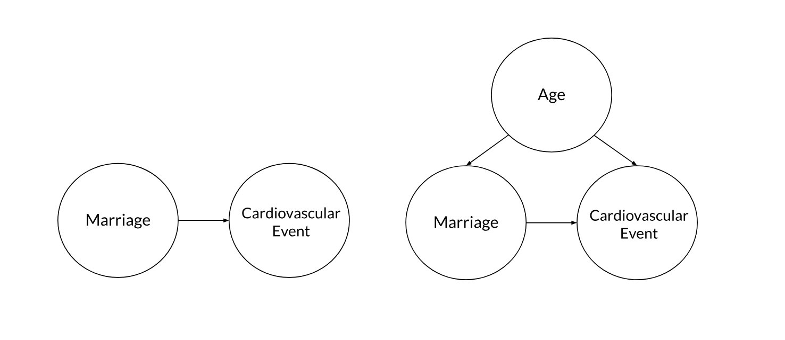
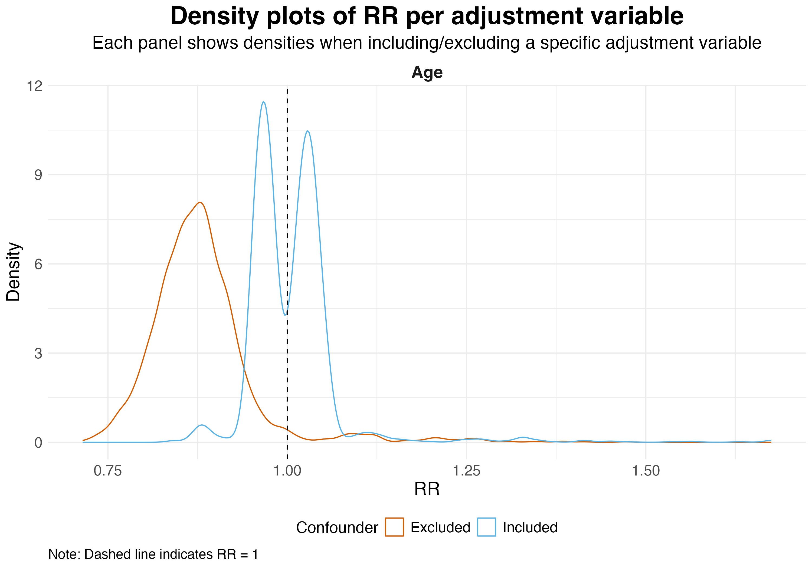

## The Problem

- Many-analyst studies reveal **considerable variability** in effect sizes when independent researchers analyse the **same data**.

. . .

> Does this variation reflect **harmful arbitrary noise** or **helpful substantially meaningful differences**?

. . .

\

- Classify sources of variation.

. . .

- Many-analyst studies **describe** but **do not quantify** decision sensitivity.

---

## Present Study

- **Method:** Multiverse analysis across analytical paths.

. . .

- Inferential statistics on the multiverse using **k-sample Anderson–Darling tests**.

. . . 

- **Case study:** @kowall_marital_2025 many-analyst project
- 16 teams, 6 decisions

\ 

. . . 

> Quantify the relative contribution of harmful vs. helpful decisions to effect size variation.

## Overall Multiverse Results

::: {.columns}
::: {.column width="50%"}
- 4,913 analyses

\

- Effect sizes ranged from \
**0.71** to **1.68**.
:::

::: {.column width="50%"}
| Effect size |  |
|---|---|
| Significantly negative (RR < 1, p < .05) | **65.3%** |
| Significantly positive (RR > 1, p < .05) | **14.3%** |
| Non-significant | **20.4%** |
:::
:::

\

- Different analytical pathways can lead to **different conclusions**.

---

## Decision Sensitivity

- **Statistical model choice** → harmful

- **Adjustment set** → helpful

. . .

- Sensitivity to **age** and **sex adjustment** reflect meaningful differences in what was estimated, not arbitrary noise.

{width="80%" fig-align="center"}

## 

{width="80%" fig-align="center"}

---

## Discussion

- Effect size variation was **partly meaningful, partly noise**.

. . . 

- Analytical choices are **rarely independent**.

- Categorising decisions as purely harmful or helpful is difficult. 

\

. . . 

> Different analyses do not always answer the same question, so finding different results is not always **surprising**.

. . .

::: {style="text-align: center; margin-top: 1em;"}
**Thank you! Questions?**
:::

---

## References

