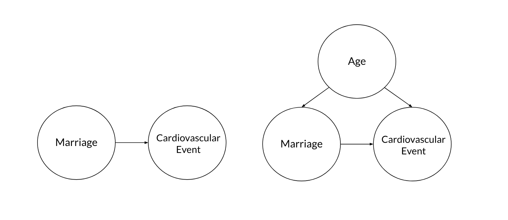
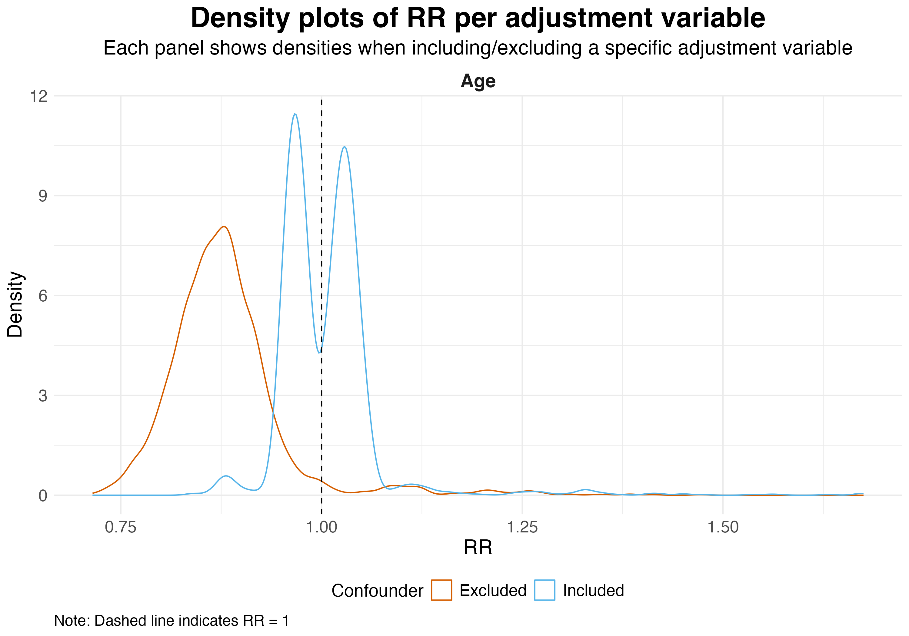

## The Problem

- Many-analyst studies reveal **considerable variability** in effect sizes when independent researchers analyse the **same data**.

\ 

. . . 

> Does this variation reflect **harmful arbitrary noise** or **helpful substantially meaningful differences**?

. . .


- Classify sources of variation.

. . .


- Many-analyst studies **describe** but **do not quantify** decision sensitivity.

---

## Present Study


- **Method:** Multiverse analysis across analytical paths.

. . .

- Inferential statistics on the multiverse using **k-sample Anderson–Darling tests**.

. . . 

- **Case study:** @kowall_marital_2025 many-analyst project.
- 16 teams, 6 decisions


\ 

. . . 


> Quantify the relative contribution of harmful vs. helpful decisions to effect size variation.


## Overall Multiverse Results

- 4,913 analyses

- Effect sizes ranged from
**0.71** to **1.68**.


```{r}
library(kableExtra)

df <- data.frame("Effect Size" = c("Significantly negative (RR < 1)", "Significantly positive (RR > 1)", "Non-significant"), 
           "Percentage" = c("65.3%", "14.3%", "20.4%"), check.names=F)

df <- df |>
  kable(
    booktabs = TRUE,
    digits = 2,
    escape = FALSE,
    linesep = ""
  ) |>
  kableExtra::kable_styling(font_size = 11) |>
  kableExtra::column_spec(1:2, width = "4cm")

df
```


- Different analytical pathways can lead to **different conclusions**.

---

## Decision Sensitivity

- **Statistical model choice** → harmful


- **Adjustment set** → helpful

. . .

- Sensitivity to **age** and **sex adjustment** reflect meaningful differences in what was estimated, not arbitrary noise.

{width="80%" fig-align="center"}


## 

{width="100%" fig-align="center"}

---

## Discussion

- Effect size variation was **partly meaningful, partly noise**.

. . . 

- Analytical choices are **rarely independent**.

- Categorising decisions as purely harmful or helpful is difficult. 

\

. . . 

> Different analyses do not always answer the same question, so finding different results is **not always surprising**.


. . .

::: {style="text-align: center; margin-top: 1em;"}
**Thank you! Questions?**
:::

---

## References

